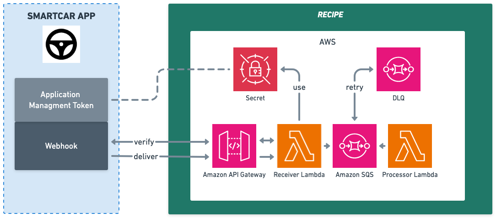

# Typescript Smartcar Webhook Receiver

## Design
This application is designed to receive Smartcar webhook events and process them asynchronously.


The API Gateway receives incoming webhook events and forwards them the [Receiver](src/lambdas/api/index.ts) lambda.

The **Receiver** lambda...
1. Validates the webhook URI by responding to the [initial verification challenge](https://smartcar.com/docs/integrations/webhooks/callback-verification)
2. Validates the webhook event payload using the [Smartcar signature header](https://smartcar.com/docs/integrations/webhooks/payload-verification)
3. Forwards valid webhook events to an SQS queue
4. Returns a 200 OK response to Smartcar

The SQS queue triggers the [Processor](src/lambdas/sqs/index.ts) Lambda function. This function can be customized to perform any processing required for **your** application.

The **Processor** lambda...

1. Works in batches of 10. Partial batch failure is supported allowing individual records in a batch to fail for retry.
2. Retries failed messages 3 times. Upon failure the message will go to the Dead Letter Queue
3. Contains sample code that makes use of the Smartcar SDK. Remember to configure your Webhook to include the signals your code needs.

## Setup

### Code
1. NodeJS v22
2. Typescript
3. NPM

### AWS
1. [AWS CLI](https://docs.aws.amazon.com/cli/latest/userguide/getting-started-install.html)
2. [CDK CLI](https://docs.aws.amazon.com/cdk/v2/guide/prerequisites.html)
3. [CDK Bootstrap](https://docs.aws.amazon.com/cdk/v2/guide/bootstrapping-env.html)

### Tools
1. GNU Make

#### Debian/Ubuntu
```bash
sudo apt update
sudo apt install -y build-essential
```

#### MacOS
```bash
xcode-select --install
```

### AWS Account Profile/Auth

To deploy and manage resources, you need to authenticate with AWS. There are two common methods:

#### a. AWS SSO (Recommended)
AWS Single Sign-On (SSO) allows you to securely log in and manage multiple AWS accounts.
- [Set up AWS SSO](https://docs.aws.amazon.com/singlesignon/latest/userguide/getting-started.html)
- [Configure AWS CLI for SSO](https://docs.aws.amazon.com/cli/latest/userguide/sso-configure-profile.html)

After setup, run:
```bash
aws sso login
```
This authenticates your CLI session using your SSO credentials.

#### b. Environment Variables (Access Keys)
You can also authenticate using AWS Access Key ID and Secret Access Key.
- [Configure AWS credentials using environment variables](https://docs.aws.amazon.com/cli/latest/userguide/cli-configure-envvars.html)

Set the following environment variables:
```bash
export AWS_ACCESS_KEY_ID=<your-access-key-id>
export AWS_SECRET_ACCESS_KEY=<your-secret-access-key>
export AWS_DEFAULT_REGION=<your-region>
```

#### Setting the Default AWS Profile
To set your target AWS account as the default profile, update `~/.aws/config`:
```ini
[default]
sso_account_id=<your-target-account>
sso_role_name=AdministratorAccess
sso_start_url=<your-sso-start-url>
sso_region=<your-region>
region = <your-region>
output = json
```

For more details, see [AWS CLI configuration documentation](https://docs.aws.amazon.com/cli/latest/userguide/cli-configure-quickstart.html).

> **__NOTE:__** You must authenticate with a role that has sufficient permissions to assume CDK execution roles for deployment. Bootstrap processes for CDK will also require elevated permissions. Learn more about permissions [here](https://aws.amazon.com/blogs/devops/secure-cdk-deployments-with-iam-permission-boundaries/)

## Usage
1. Login to AWS SSO
    ```bash
    aws sso login
    ```

    > **__NOTE:__** Makefile commands use the configured default AWS profile. Ensure that your environment variables or ~/.aws/config file are set to your target AWS Account. See [AWS CLI docs](https://docs.aws.amazon.com/cli/latest/userguide/cli-configure-sso.html) for more info.

2. Create Application Management Token SECRET. Get the value used in the following command from the [Smartcar Dashboard](https://dashboard.smartcar.com/)-> Configuration-> API Keys
    ```bash
    make create-secret appName=<your-app-name> amt=<your-application-management-token>
    ```

3. Deploy
    ```bash
    make deploy appName=<your-app-name>
    ```

    > **__NOTE:__** Use the same `<your-app-name>` as used when creating the secret

4. Copy the **ApiEndpointUrl** output from the successful command above and paste it in the [Smartcar Webhook Callback URI](https://dashboard.smartcar.com/)

5. Subscribe vehicles to your webhook in the Smartcar Dashboard and see incoming events logged to CloudWatch log groups.

For more information on webhook setup, see [Smartcar's documentation](https://smartcar.com/docs/integrations/webhooks/overview).

## Removal
```bash
make destroy appName=<your-app-name>
```
