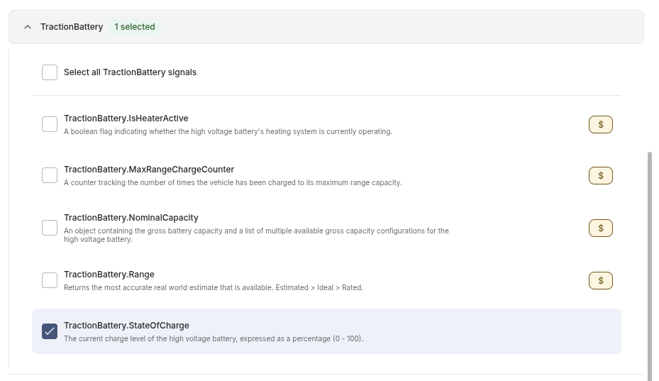

# AWS Typescript Webhook Receiver 
## Async Processing Pattern

## About
This recipe uses an AWS API Gateway and AWS Lambda to receive verification and data webhook calls. Events requiring further processing are sent to AWS SQS and handled by AWS Lambda asynchronously.


## Deploy
1. Follow [Prerequisites](#Prerequisites) instructions. Authorize with your target AWS Account.

1. Create the **Application Management Token** SECRET. Get the value used in the following command from the [Smartcar Dashboard](https://dashboard.smartcar.com/)-> Configuration-> API Keys
    ```bash
    make create-secret appName=<your-app-name> amt=<your-application-management-token>
    ```

3. Deploy the stack
    ```bash
    make deploy appName=<your-app-name>
    ```

    > **__IMPORTANT:__** Use the same `<your-app-name>` for both commands

4. Copy the **ApiEndpointUrl** OUTPUT from the successful **deploy** command above and paste it in the [Smartcar Webhook Callback URI](https://dashboard.smartcar.com/)

5. Subscribe vehicles to your webhook in the Smartcar Dashboard and see incoming events logged to CloudWatch log groups.

For more information on webhook setup, see [Smartcar's documentation](https://smartcar.com/docs/integrations/webhooks/overview).

> **__NOTE:__** The default processer lambda is configured to check for the `tractionbattery-stateogcharge` signal. So, you should configure a webhook using the `tractionbattery-stateofcharge` signal for initial testing.


## Implementation


1. Verification call is made from the Smartcar webhook.
    
2. The **Application Management Token** saved in AWS Secrets Manager is used to answer the verification challenge. The **@smartcar/webhooks** [SDK](https://github.com/smartcar/typescript-backend-sdks) is used in the [Receiver](src/lambdas/api/index.ts) lambda. 
    ```
    const isValid = verifySignature(
                applicationManagementToken || '',
                JSON.stringify(eventPayload),
                event.headers["SC-Signature"] || '',
            );
    ```
    > **__NOTE:__** Only successfully verified webhook endpoints are eligible to receive data.

3. Data changes for configured signals will call your verified webhook endpoint with payloads containing selected data points in your **Integration**. 

    > **__NOTE:__** After Smartcar requests verification, you should perform your own verification of the sender. Use the [SDK](https://github.com/smartcar/typescript-backend-sdks). 
    ```
        const isValid = verifySignature(
                applicationManagementToken || '',
                JSON.stringify(eventPayload),
                event.headers["SC-Signature"] || '',
            );
    ```

4. The [Receiver](src/lambdas/api/index.ts) lambda will send a command to AWS SQS for processing and retry. This endpoint must return a success quickly, so avoid complex or high latency logic in the Receiver.

    ```
        const params = {
            QueueUrl: process.env.QUEUE_URL!,
            MessageBody: event.body
        }
        const command = new SendMessageCommand(params);
        const response = await sqsClient.send(command);
        return {
            statusCode: 200,
            body: JSON.stringify({
                message: 'Webhook received successfully',
            }),
        };
    ```

5. The [Processor](src/lambdas/sqs/index.ts) lambda will handle the queued commands. Failures here are set to automatically retry 3 times before being sent to the DLQ ([see implementation](/lib/webhook-receiver-stack.ts#L32)).

> **__NOTE:__** Infrastructure settings like Log Level and Lambda timeouts are defined [here](/lib/webhook-receiver-stack.ts)

## Prerequisites

Before deploying this webhook receiver, ensure you have the following installed and configured:

### Required Software
- **Node.js v22** - [Download here](https://nodejs.org/)
- **AWS CLI** - [Installation guide](https://docs.aws.amazon.com/cli/latest/userguide/getting-started-install.html)
- **AWS CDK CLI** - Install with `npm install -g aws-cdk`
- **GNU Make** - Usually pre-installed on macOS/Linux

**macOS users:** Install Xcode command line tools if Make is missing:
```bash
xcode-select --install
```

**Ubuntu/Debian users:** Install build tools if Make is missing:
```bash
sudo apt update && sudo apt install -y build-essential
```

### AWS Setup

1. [**Bootstrap CDK**](https://docs.aws.amazon.com/cdk/v2/guide/bootstrapping-env.html) (one-time setup per AWS account/region)

2. **Configure Authentication** - Choose one method:

   **Option A: [AWS SSO](https://docs.aws.amazon.com/cli/latest/userguide/cli-configure-sso.html) (Recommended)**
   ```bash
   # Configure SSO profile
   aws configure sso
   # Login when needed
   aws sso login
   ```
    Set your target AWS account as the **default** profile. Update `~/.aws/config`:
    ```ini
    [default]
    sso_account_id=<your-target-account>
    sso_role_name=AdministratorAccess
    sso_start_url=<your-sso-start-url>
    sso_region=<your-region>
    region = <your-region>
    output = json
    ```
   **Option B: [Access Keys](https://docs.aws.amazon.com/cli/v1/userguide/cli-configure-envvars.html)**
   ```bash
   export AWS_ACCESS_KEY_ID=<your-access-key>
   export AWS_SECRET_ACCESS_KEY=<your-secret-key>
   export AWS_DEFAULT_REGION=<your-region>
   ```

3. **Verify Setup**:
   ```bash
   aws sts get-caller-identity
   ```

> **⚠️ Important:** You must use a role that has sufficient permissions to assume CDK execution roles for deployment. Bootstrap processes for CDK will also require elevated permissions. Learn more about permissions [here](https://aws.amazon.com/blogs/devops/secure-cdk-deployments-with-iam-permission-boundaries/)


## Removal
```bash
make destroy appName=<your-app-name>
```
